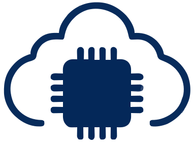

<div align="center">
    <a href="https://github.com/MatterCoder/Matterflow">
        
    </a>
    <div style="display: flex;"><h1>Matterflow</h1></div>
    <br>
    <br>
    <div style="display: flex;">
        <a href="https://github.com/MatterCoder/Matterflow/actions?query=workflow%3ACI">
            
        </a>
        <a href="https://github.com/MatterCoder/Matterflow/releases">
            
        </a>
        <a href="https://github.com/MatterCoder/Matterflow/stargazers">
            
        </a>
        <a href="https://discord.gg/your-discord-link">
            
        </a>
    </div>
    <h1>Home Assistant Add-on: IoT Data Workflow Manager</h1>
</div>

## Overview

The IoT Data Workflow Manager is a powerful Home Assistant add-on that simplifies working with data from **Matter-enabled IoT devices**. It seamlessly integrates with your Home Assistant setup to:

- Automatically **receive and process IoT data**.
- Transform and model data for use in various formats like **CSV** or **JSON**.
- Send processed data to the cloud for **AI applications** or store it locally for further analysis.

This add-on is ideal for developers, data scientists, and IoT enthusiasts looking to unlock the full potential of their smart devices.

---

## Installation

### Prerequisites

1. Ensure your Home Assistant installation is up and running.
2. An MQTT broker is required for communication with Matter devices. If you don't have one:
   - Go to **[Settings → Add-ons → Add-on store](https://my.home-assistant.io/redirect/supervisor_store/)**.
   - Install the **[Mosquitto broker](https://my.home-assistant.io/redirect/supervisor_addon/?addon=core_mosquitto)** add-on and start it.

### Add the Repository

1. Go to the **Add-on store** in Home Assistant.
2. Click **⋮ → Repositories**, and paste the following URL:
Certainly! Below is the provided content in proper Markdown format suitable for a README.md file:

<div align="center">
    <a href="https://github.com/MatterCoder/Matterflow">
        
    </a>
    <br>
    <br>
    <div style="display: flex;">
        <a href="https://github.com/MatterCoder/Matterflow/actions?query=workflow%3ACI">
            
        </a>
        <a href="https://github.com/MatterCoder/Matterflow/releases">
            
        </a>
        <a href="https://github.com/MatterCoder/Matterflow/stargazers">
            
        </a>
        <a href="https://discord.gg/your-discord-link">
            
        </a>
    </div>
    <h1>Home Assistant Add-on: IoT Data Workflow Manager</h1>
</div>

## Overview

The IoT Data Workflow Manager is a powerful Home Assistant add-on that simplifies working with data from **Matter-enabled IoT devices**. It seamlessly integrates with your Home Assistant setup to:

- Automatically **receive and process IoT data**.
- Transform and model data for use in various formats like **CSV** or **JSON**.
- Send processed data to the cloud for **AI applications** or store it locally for further analysis.

This add-on is ideal for developers, data scientists, and IoT enthusiasts looking to unlock the full potential of their smart devices.

---

## Installation

### Prerequisites

1. Ensure your Home Assistant installation is up and running.
2. An MQTT broker is required for communication with Matter devices. If you don't have one:
   - Go to **[Settings → Add-ons → Add-on store](https://my.home-assistant.io/redirect/supervisor_store/)**.
   - Install the **[Mosquitto broker](https://my.home-assistant.io/redirect/supervisor_addon/?addon=core_mosquitto)** add-on and start it.

### Add the Repository

1. Go to the **Add-on store** in Home Assistant.
2. Click **⋮ → Repositories**, and paste the following URL:

https://github.com/MatterCoder/Matterflow

Click **Add → Close**, or click the button below to add the repository directly:  
[](https://my.home-assistant.io/redirect/supervisor_add_addon_repository/?repository_url=https%3A%2F%2Fgithub.com%2Fyour-username%2Fyour-repository)

3. The repository includes two add-ons:
- **IoT Data Workflow Manager** (Stable): Recommended for most users.
- **IoT Data Workflow Manager Edge**: Tracks the latest development branch with new features and fixes.

4. Select the add-on and click **Install**.

### Configuration

1. After installation, go to the add-on's **Configuration** tab:
- **MQTT**: Fill in the details if not using the Mosquitto broker add-on. For example:
  ```yaml
  mqtt:
    server: mqtt://localhost:1883
    username: my_username
    password: my_password
  ```
  If the password contains special characters, surround it with quotes.
- **Data Transformations**: Specify custom transformation rules (optional). See the [documentation](#documentation) for details.

2. Save the configuration and start the add-on.

3. Open the Web UI to verify the add-on is running.  
- If it shows `502: Bad Gateway`, wait a moment and refresh the page.
- Check the **Log** tab for errors if the add-on doesn't start.

---

## Features

- **Automatic Device Detection**: Automatically discovers Matter devices on your network.
- **Data Transformation**: Supports custom rules for transforming incoming data.
- **Storage Options**: Save data locally as **CSV** or **JSON**, or send it to a remote server.
- **AI-Ready**: Seamlessly export data for machine learning or AI-driven analysis.

---

## Troubleshooting

### Common Issues

- **No data received from devices**:
- Ensure your MQTT broker is running and configured correctly.
- Verify device connectivity and compatibility with Matter.

- **Add-on fails to start**:
- Check the logs for configuration errors.
- Ensure dependencies like the Mosquitto broker are installed and running.

### Logs

View detailed logs in the **Log** tab of the add-on to diagnose issues.

---

## Documentation

Comprehensive documentation is available in the [docs folder](https://github.com/MatterCoder/Matterflow/docs). Topics include:

- Advanced configuration
- Custom data transformation rules
- Sending data to cloud platforms

---

## Contributing

We welcome contributions! Check out the [contribution guidelines](https://github.com/MatterCoder/Matterflow/CONTRIBUTING.md) to get started. Issues and pull requests are always appreciated.

---

## Changelog

All notable changes will be documented in [CHANGELOG.md](CHANGELOG.md). The versioning follows the format:

- Stable releases: `X.Y.Z`
- Development versions: `X.Y.Z-Dev`

---

## License

This project is licensed under the [Apache License](LICENSE).

## Credits

- [ivobrett](https://github.com/oidebrett)
